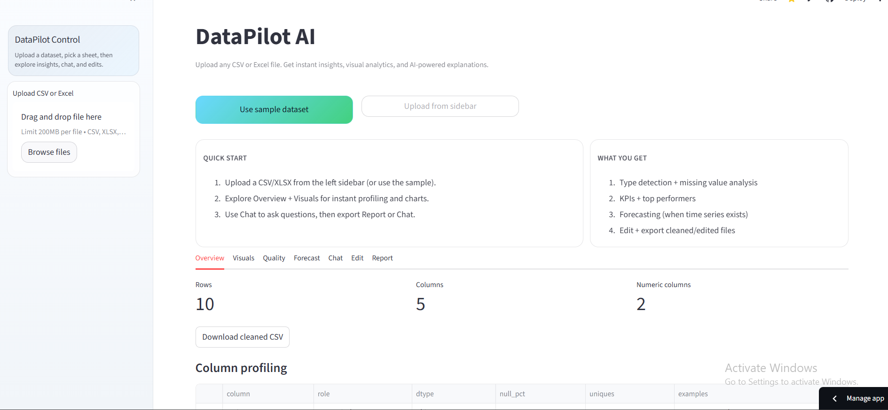
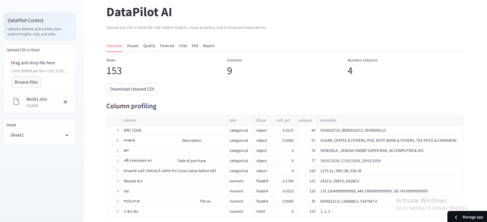
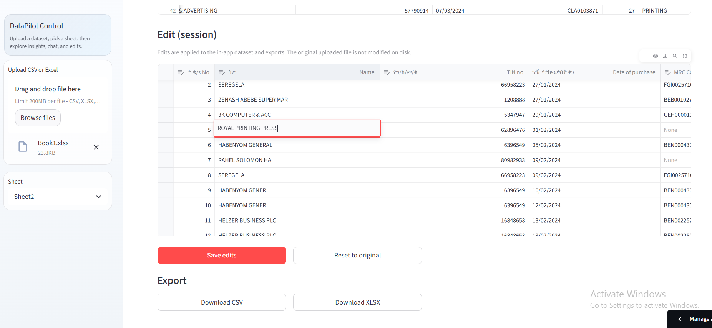
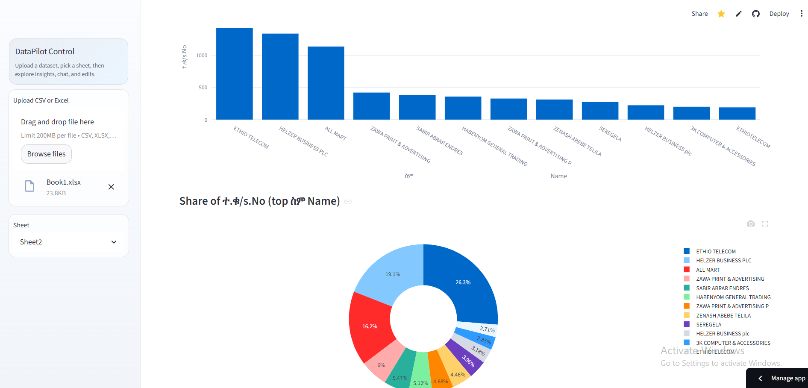
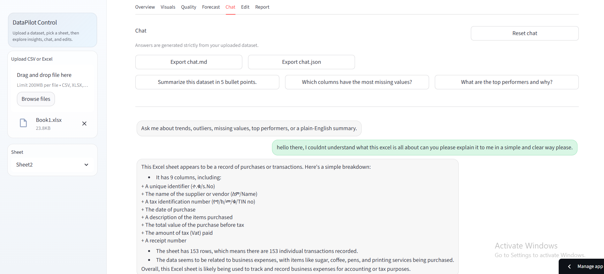
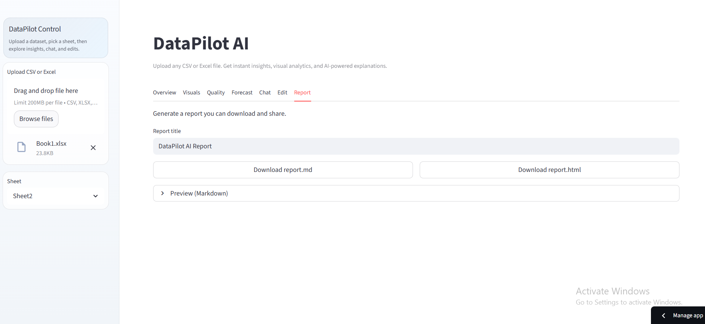

# DataPilot AI

<p align="center">
  <strong>Upload any CSV or Excel file. Get instant profiling, visuals, KPIs, forecasting, report export, and AI-assisted explanations.</strong>
</p>

<p align="center">
  Built for spreadsheet-heavy teams that need fast answers before moving into heavier BI workflows.
</p>

---

## Overview

DataPilot AI is a Streamlit-based analytics application that turns raw tabular files into a usable first-pass intelligence workspace.

Instead of forcing users into predefined schemas, templates, or dashboards, the app accepts general-purpose CSV and Excel files and automatically:

- loads and cleans messy tabular input
- profiles columns and infers data roles
- surfaces KPIs and data quality issues
- generates charts from the detected structure
- answers questions about the uploaded dataset
- supports session-based editing and export
- creates shareable Markdown and HTML reports

It is designed for analysts, finance teams, operations teams, and business users who often work from spreadsheets and want a faster path from file upload to usable insight.

---

## Why This Project Exists

Many organizations have data, but not a clean analytics workflow.

- Spreadsheets are everywhere
- BI tools are powerful, but expensive or time-consuming to set up
- Non-technical users still need immediate explanations
- Messy Excel exports often break simplistic import tools

DataPilot AI bridges that gap with a practical analysis layer for tabular business data.

---

## What DataPilot AI Does

### 1. Flexible CSV and Excel ingestion

- Supports `CSV`, `XLSX`, `XLS`, and `XLSM`
- Detects CSV encoding automatically
- Lists Excel sheets for selection
- Tries to recover useful headers from template-like spreadsheets
- Can detect multiple tables inside a messy Excel sheet

### 2. Automatic dataset understanding

- Infers column roles such as `numeric`, `datetime`, `categorical`, and `identifier`
- Builds column-level profiles
- Computes missing-value and uniqueness summaries
- Produces numeric descriptive statistics and correlations where possible

### 3. Visual analytics

- Time-series charts
- Distributions and box plots
- Correlation heatmaps
- Category comparisons and share views

### 4. KPI generation

- row and column counts
- averages and totals for numeric fields
- month-over-month change when time data exists
- top categories by selected numeric metrics

### 5. Data quality checks

- missing-value analysis
- z-score outlier detection

### 6. Forecasting

- simple explainable forecasting for time-series datasets
- linear regression over aggregated time periods

### 7. AI-assisted analytics

Optional AI features are available through an OpenAI-compatible API setup such as Groq:

- executive insight generation
- chat with your data
- edit planning from plain-English instructions

### 8. Editing and export

- session-based table editing
- reversible edit workflow
- AI edit planning with a reviewable plan
- export to `CSV` and `XLSX`
- report export to `Markdown` and `HTML`
- chat export to `Markdown` and `JSON`

---

## Screenshots

### Home and Overview



### Dataset Profiling



### Interactive Editing



### Visual Analytics



### Chat With Your Data



### Report Export



---

## Core Features at a Glance

| Area | Capabilities |
| --- | --- |
| File ingestion | CSV/Excel upload, sheet selection, encoding detection, messy Excel handling |
| Profiling | role inference, null analysis, unique counts, examples, numeric summary |
| Visuals | line chart, histogram, heatmap, box plot, bar chart, pie chart |
| Quality | missing-value analysis, outlier detection |
| Forecasting | simple time-series forecasting |
| AI layer | insights, chat, edit copilot |
| Export | cleaned CSV, edited CSV/XLSX, report.md, report.html, chat exports |

---

## Tech Stack

- Python
- Streamlit
- Pandas
- NumPy
- Plotly
- Scikit-learn
- OpenPyXL
- charset-normalizer
- OpenAI-compatible APIs such as Groq

---

## Project Structure

```text
Datapilot-AI/
|- app.py
|- pyproject.toml
|- requirements.txt
|- README.md
|- LICENSE
|- images/
|- core/
|  |- chat.py
|  |- edit_copilot.py
|  |- forecasting.py
|  |- insights.py
|  |- kpis.py
|  |- loader.py
|  |- profiler.py
|  |- quality.py
|  |- report.py
|  `- visualizer.py
|- datapilot/
|  |- __main__.py
|  `- cli.py
|- data/
|  `- samples/
`- utils/
   `- helpers.py
```

---

## How It Works

1. A user uploads a CSV or Excel file.
2. The loader normalizes the dataset and handles common spreadsheet irregularities.
3. The profiler infers column roles and builds dataset metadata.
4. KPI, quality, and visualization modules compute the first-pass analysis.
5. Optional AI features generate explanations and dataset Q&A using the uploaded data context.
6. The edited or analyzed result can then be exported as files or reports.

---

## Local Setup

### Requirements

- Python `3.10+`
- `pip`

### Install dependencies

```bash
pip install -r requirements.txt
```

### Recommended editable install

```bash
pip install -e .
```

### Run the app

```bash
datapilot
```

Or without editable install:

```bash
python -m datapilot
```

Direct Streamlit launch also works:

```bash
streamlit run app.py
```

---

## AI Configuration

Create a `.env` file in the project root if you want AI features enabled.

Example using Groq:

```env
OPENAI_API_KEY=your_groq_key_here
OPENAI_BASE_URL=https://api.groq.com/openai/v1
DATAPILOT_MODEL=llama-3.3-70b-versatile
```

If no API key is configured, the app still works for:

- upload and profiling
- visuals
- KPIs
- data quality checks
- forecasting
- manual editing
- report export

The AI chat and AI-generated insights will fall back to limited offline behavior.

---

## Deployment

The simplest deployment path is Streamlit Community Cloud.

1. Push the repository to GitHub
2. Create a Streamlit app
3. Set the entrypoint to `app.py`
4. Add your secrets in Streamlit settings

Example Streamlit secrets:

```toml
OPENAI_API_KEY="your_groq_key_here"
OPENAI_BASE_URL="https://api.groq.com/openai/v1"
DATAPILOT_MODEL="llama-3.3-70b-versatile"
```

---

## Ideal Use Cases

- quick spreadsheet intelligence for business teams
- finance and operations review
- exploratory analysis before building dashboards
- cleaning and understanding third-party Excel exports
- lightweight reporting for internal decision making

---

## License

This project is released under the MIT License.

Copyright (c) 2026 Nathnael Wondwosen

See [LICENSE](LICENSE) for details.
